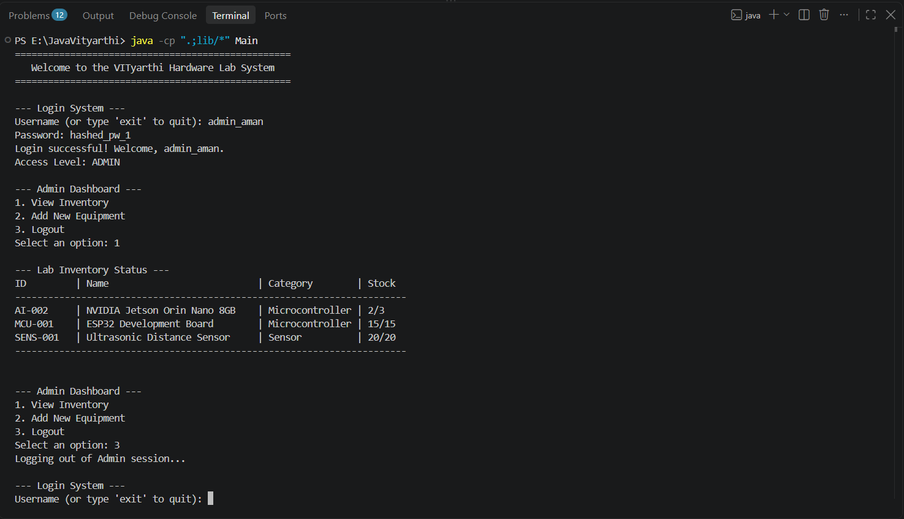
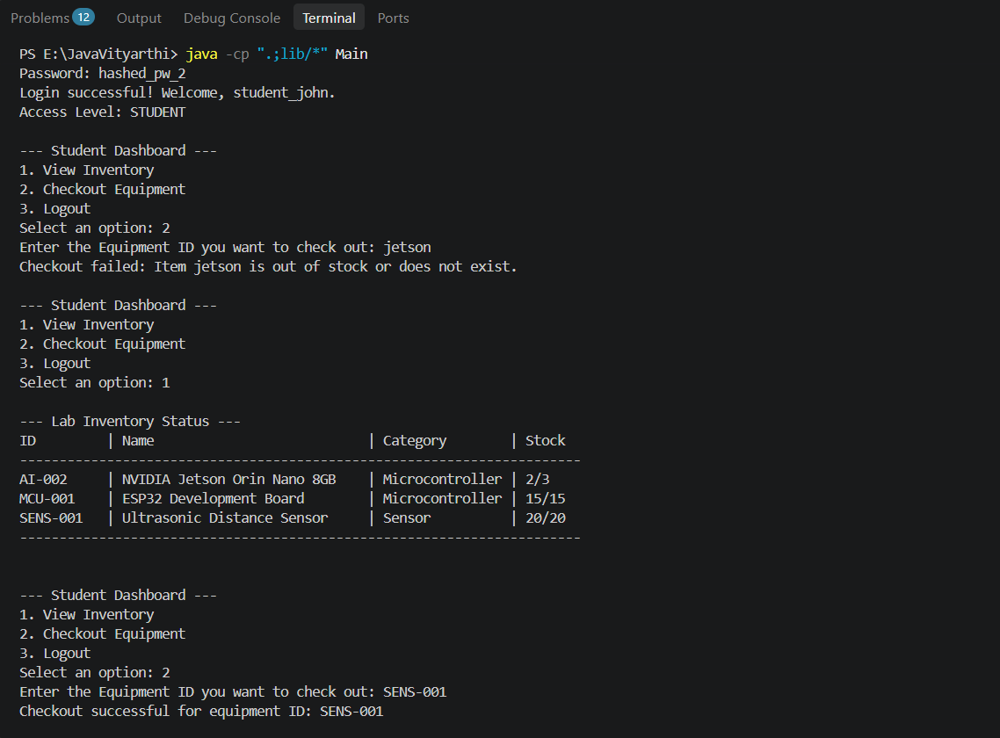
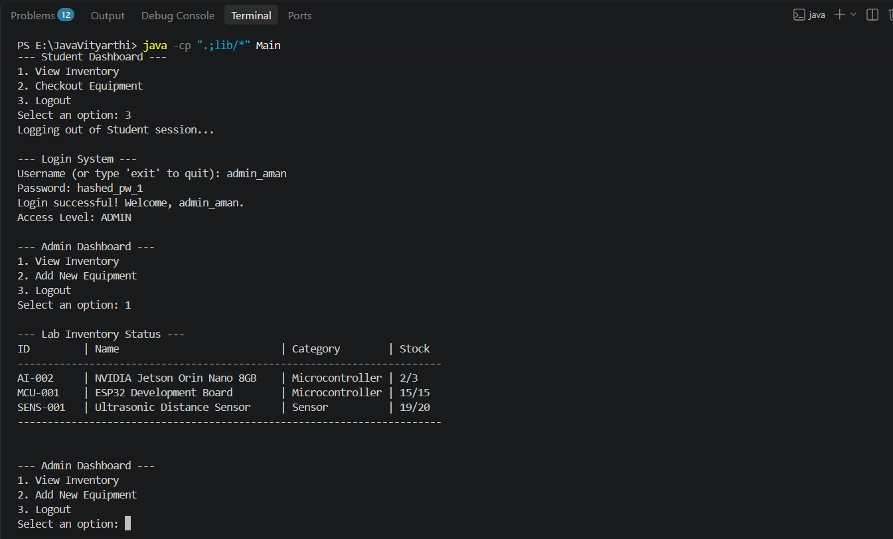

Hey There,
Problem- Physical logbooks and static spreadsheets currently used in engineering hardware labs lead to misplaced assets, accountability gaps when items are not returned, and frustration for students who cannot check stock availability before visiting the lab. The lack of real-time synchronization between borrowed items and available stock creates inefficiencies for both students and lab administrators.

We are using-
Java
SQL
JDBC

Here are few screenshots of the working

